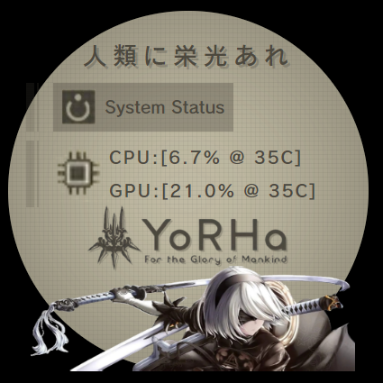

# NZXT Z63 Nier Automata Web Integration V1 forked by BakaVaca

Web interface for Kraken Z63

## Quickstart
Paste the following url in NZXT CAM: [NZXT-NieR-V1.BakaVaca.com](NZXT-NieR-V1.bakavaca.com)

## Note
This is version 1. I plan to create more versions, but please note that earlier versions will not be maintained. I will only keep up with the versions I actively use.

Future plans for upcoming versions include: removing the Japanese text and replacing it with the YoRHa logo, and adding an additional 'chip' for monitoring System and GPU Memory Usage, as these metrics are becoming more critical for me and others to track

This version is specifically tailored for the Z63, which has a different resolution compared to the Elite. If you need to make edits, follow the steps below. However, please note that I manually adjusted the pixel counts, as my attempts to automate and dynamically adjust them resulted in the content exceeding the circle's boundaries. My CSS skills were not sufficient to resolve this issue. Apologies for any inconvenience.

## Installation
1 - Install Node.js  
2 - Clone the repo  
3 - Run `npm install`

Now you can manually start the interface with the command `node index.js`

Use the url [http://127.0.0.1:2553/](http://127.0.0.1:2553/) in NZXT CAM.

## Credits
Credits to [Roberto (Greenstgreen)](https://github.com/Greenestgreen) being the original creator who based it on [this](https://codepen.io/levise/pen/vMzEwr) and he gives credits to [Lev](https://codepen.io/levise)
